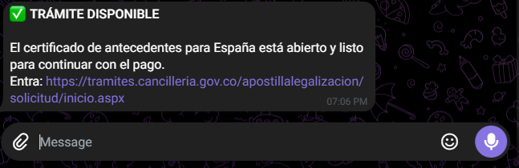

```markdown
   

# 🛰️ Monitor Cancillería — Antecedentes Judiciales para España

[](https://github.com/bryan0912/cancilleria-monitor-bot/actions/workflows/ci.yml)


Bot en **Python** que automatiza la consulta del estado del trámite de
**Certificado de Antecedentes Judiciales** de la Cancillería de Colombia
(para apostilla con destino España), y envía una notificación a **Telegram**
con el resultado: ✅ disponible / ❌ fuera de servicio.

El proyecto corre en **GitHub Actions** y se ejecuta **manualmente** desde la
pestaña *Actions* del repositorio, sin necesidad de mantener ningún servidor
encendido.

> ⚠️ **Aviso**: Proyecto educativo / de monitoreo personal. No está afiliado
> a la Cancillería ni al Gobierno de Colombia. Úsalo bajo tu responsabilidad
> y respetando los términos de uso del sitio.

---

## ✨ Características

- 🤖 Automatización completa con **Playwright** (Chromium headless).
- 📲 Notificaciones a **Telegram** vía Bot API.
- ☁️ Ejecutable desde **GitHub Actions** con un solo clic.
- 🔐 Credenciales manejadas como **GitHub Secrets** (nunca en el código).
- 🎯 Detección robusta: diferencia entre "sitio disponible" y "sitio caído".
- 🧪 Modo `DRY_RUN` para probar sin enviar mensajes reales.

---

## 🧠 ¿Cómo funciona?

1. Playwright abre el portal de la Cancillería.
2. Navega el formulario paso a paso (tipo de documento, datos personales,
   fecha de expedición, país destino).
3. Al llegar a la pantalla final, inspecciona el texto visible buscando
   señales de éxito (`forma de pago`, `crear solicitud`, etc.) o de error
   (`fuera de servicio`, `no disponible`).
4. Envía el resultado a Telegram.

| Resultado | Mensaje |
|---|---|
| ✅ Sitio disponible | "El certificado está abierto y listo para el pago." |
| ❌ Sitio caído | "El sistema sigue fuera de servicio." |

---

## 🛠️ Stack

- **Python 3.12**
- **Playwright** (automatización del navegador)
- **Requests** (envío a Telegram)
- **python-dotenv** (gestión de credenciales en local)
- **GitHub Actions** (ejecución en la nube)
- **Telegram Bot API** (notificaciones)

---

## 🚀 Cómo usarlo

### Requisitos previos

1. Tener una cuenta de **Telegram**.
2. Crear un **bot** hablando con [@BotFather](https://t.me/BotFather) y
   guardar el token.
3. Obtener tu **chat_id**:
   - Envía `/start` a tu bot.
   - Abre `https://api.telegram.org/bot<TU_TOKEN>/getUpdates`
   - Copia el valor de `chat.id`.

### Configuración en GitHub

1. Fork o clona este repositorio.
2. Ve a **Settings → Secrets and variables → Actions**.
3. Crea los siguientes **Repository secrets**:

| Secret | Descripción |
|---|---|
| `CEDULA` | Número de cédula del titular |
| `CORREO` | Correo electrónico de contacto |
| `FECHA_EXPEDICION` | Fecha de expedición de la cédula (`dd/mm/aaaa`) |
| `BOT_TOKEN` | Token del bot de Telegram |
| `CHAT_ID` | ID del chat donde recibirás las alertas |

### Ejecución

1. Ve a la pestaña **Actions** del repositorio.
2. Selecciona el workflow **Monitor Cancillería**.
3. Haz clic en **Run workflow** → **Run workflow**.
4. Espera ~2 minutos.
5. Recibirás un mensaje en Telegram con el estado del trámite.

---

## 💻 Uso local (opcional)

Si prefieres correrlo en tu máquina:

```bash
# Clonar
git clone https://github.com/bryan0912/monitor-cancilleria.git
cd monitor-cancilleria

# Crear entorno virtual
python -m venv venv

# Activar
# Windows PowerShell:
.\venv\Scripts\Activate.ps1
# macOS / Linux:
source venv/bin/activate

# Instalar dependencias
pip install -r requirements.txt
playwright install chromium

# Configurar credenciales
cp .env.example .env
# Edita .env con tus datos reales

# Ejecutar
python monitor_cancilleria.py

Variables de entorno
Variable	Descripción
CEDULA	Número de cédula
CORREO	Correo electrónico
FECHA_EXPEDICION	Fecha de expedición (dd/mm/aaaa)
BOT_TOKEN	Token del bot de Telegram
CHAT_ID	ID del chat
DRY_RUN	true = no envía mensajes reales (solo log)
CI	true = modo headless (sin ventana de navegador)


monitor-cancilleria/
├── .github/
│   └── workflows/
│       └── monitor.yml
├── .env.example
├── .gitignore
├── README.md
├── monitor_cancilleria.py
└── requirements.txt


👤 Autor
Bryan — @bryan0912

Proyecto desarrollo de automatización web con Playwright y
CI/CD con GitHub Actions.